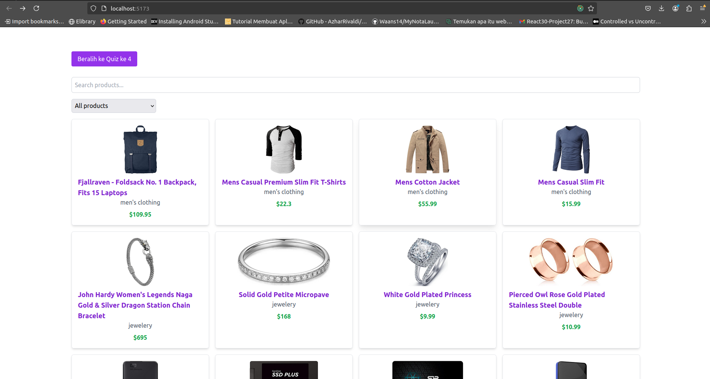
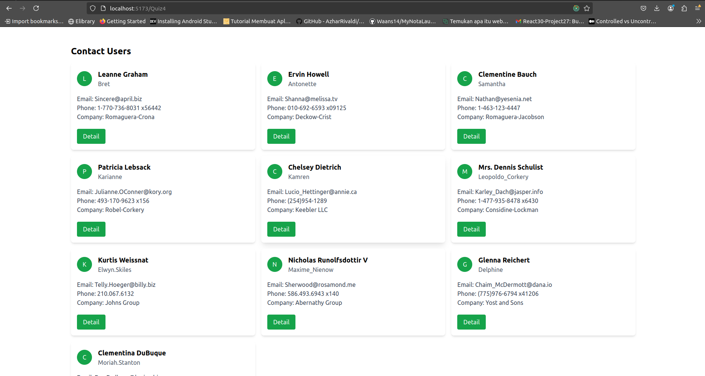

# Get started
```
npm install
```
# Running Project

```
npm run dev 
```

# About Regarding the results of the coding test to become part of Newus Technology - Read the note at the end



## Quiz3 Features

Create a React component that has a search and filter feature. Use a data array that contains a list of products, each with a name, price, and category. The component must:

1. Display a list of products.
2. Have an input for searching for product names.
3. Have a filter for selecting product categories.



## Quiz4 Features

Create a simple React app that fetches user data from a public API (example: https://jsonplaceholder.typicode.com/users ) and displays a list of those users. Include the following features:

1. Loading indicator while data is being fetched.
2. Error handling if the fetch fails.

```js
const filterProducts = products.filter((product) => {
  const matchesSearch = product.title
    // saya gunakan toLowerCase agar menjadi case insensitive
    .toLowerCase()
    .includes(searchTerm.toLowerCase());
  const matchesCategory = selectedCategory
    ? product.category === selectedCategory
    : true;

  return matchesSearch && matchesCategory;
});
```

```const Categorys = Array.from(
    // saya gunakan Set agar bisa menyimpan nilai unik
    new Set(products.map((product) => product.category))
  );

```
